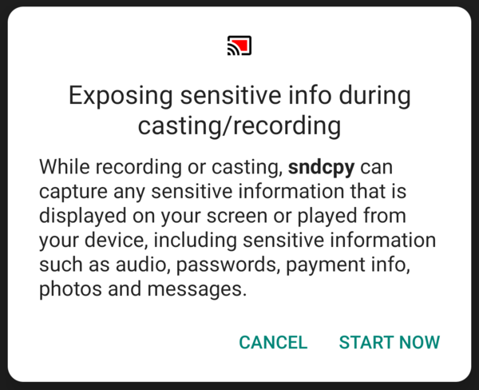

# sndcpy

This tool forwards audio from an Android 10 device to the computer. It does not
require any _root_ access. It works on _GNU/Linux_, _Windows_ and _macOS_.

The purpose is to enable [audio forwarding][issue14] while mirroring with
[scrcpy]. However, it can be used independently.

[issue14]: https://github.com/Genymobile/scrcpy/issues/14
[scrcpy]: https://github.com/Genymobile/scrcpy


## Requirements

 - The Android device requires at least Android 10.
 - [VLC] must be installed on the computer.

[vlc]: https://www.videolan.org/


## Get the app

Download the latest release:

 - [`sndcpy-v1.0.zip`][release]  
   _SHA256: 4495f752fc192535cd5208ace4d35d2ba644beb9aabb0e288ae339861ad6782b_
 - [`sndcpy-with-adb-windows-v1.0.zip`][release-adb]  
   _SHA256: 42b89b7b557b9fdf0c6f3802eac171a0e5610a50a1d615a290ed7f41cba7053d_

_On Windows, for simplicity, take the second archive, which also contains
`adb`._

[release]: https://github.com/rom1v/sndcpy/releases/download/v1.0/sndcpy-v1.0.zip
[release-adb]: https://github.com/rom1v/sndcpy/releases/download/v1.0/sndcpy-with-adb-windows-v1.0.zip

Alternatively, you could [build the app][BUILD].

[BUILD]: BUILD.md

## Run the app

Plug an Android 10 device with USB debugging enabled, and execute:

```bash
./sndcpy
```

If several devices are connected (listed by `adb devices`):

```bash
./sndcpy <serial>  # replace <serial> by the device serial
```

_(omit `./` on Windows)_

It will install the app on the device, and request permission to start audio
capture:



Once you clicked on _START NOW_, press _Enter_ in the console to start playing
on the computer. Press `Ctrl`+`c` in the terminal to stop (except on Windows,
just disconnect the device or stop capture from the device notifications).

VLC may print this error message once:

```
main stream error: connection error: Connection refused
```

It is "expected", just ignore it.

The sound continues to be played on the device. The volume can be adjusted
independently on the device and on the computer.

## Uninstall

To uninstall the app from the device:

```bash
adb uninstall com.rom1v.sndcpy
```

## Apps restrictions

`sndcpy` may only forward audio from apps which do not [prevent audio
capture][allow]. The rules are detailed in [§capture policy][rules]:

> - By default, apps that target versions up to and including to Android 9.0 do
>   not permit playback capture. To enable it, include
>   `android:allowAudioPlaybackCapture="true"` in the app's `manifest.xml` file.
> - By default, apps that target Android 10 (API level 29) or higher allow their
>   audio to be captured. To disable playback capture, include
>   `android:allowAudioPlaybackCapture="false"` in the app's `manifest.xml`
>   file.

So some apps might need to be updated to support audio capture.

[allow]: https://developer.android.com/guide/topics/media/playback-capture#allowing_playback_capture
[rules]: https://developer.android.com/guide/topics/media/playback-capture#capture_policy

## Audio delay

This is just a proof-of-concept, so it's far from perfect.

For example, jitter may cause VLC to automatically increase its buffering,
causing an unacceptable delay:

```
main input error: ES_OUT_SET_(GROUP_)PCR  is called too late (pts_delay increased to 377 ms)
```

In that case, just restart it.

## Environment variables

The scripts [`sndcpy`](sndcpy) and [`sndcpy.bat`](sndcpy.bat) use some default
values which can be overridden by environment variables.

 - `ADB`: the full path to the `adb` executable
 - `VLC`: the full path to the `vlc` executable
 - `SNDCPY_APK`: the full path to `sndcpy.apk`
 - `SNDCPY_PORT`: the local port to forward to communicate with the device


## Blog post

 - [Audio forwarding on Android 10][blogpost]

[blogpost]: https://blog.rom1v.com/2020/06/audio-forwarding-on-android-10/
